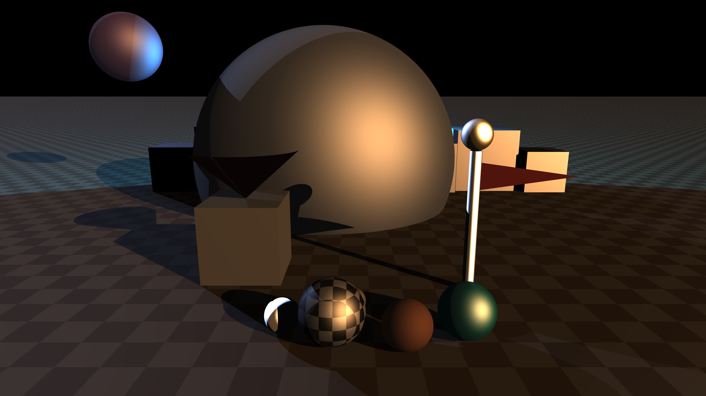

# Raytracer

A multithreaded CPU raytracer written from scratch in C++20 for Epitech's Object-Oriented Programming module (B-OOP-400). It parses a scene described in a `libconfig` file (camera, materials, primitives, lights) and renders it to a `.ppm` image using the Phong reflection model, supersampling anti-aliasing, and per-row multithreading.



## Team

**Pierre-Alexandre GROSSET** - pierre-alexandre.grosset@epitech.eu

## Features

### Primitives
- [x] Sphere
- [x] Plane
- [x] Cube
- [x] Cylinder
- [x] Cone
- [x] Triangle
- [ ] Limited cylinder (0.5)
- [ ] Limited cone (0.5)
- [ ] Torus (1)
- [ ] Tanglecube (1)
- [ ] .OBJ file (1)
- [ ] Fractals (2)
- [ ] Möbius strip (2)

### Transformations
- [x] Translation
- [x] Rotation
- [ ] Scale (0.5)
- [ ] Shear (0.5)
- [ ] Transformation matrix (2)
- [ ] Scene graph (2)
- [ ] Transparency (0.5)
- [ ] Refraction (1)
- [ ] Reflection (0.5)

### Light
- [x] Directional light
- [x] Point light
- [x] Ambient light
- [x] Drop shadows
- [x] Multiple directional lights (0.5)
- [x] Multiple point lights (1)
- [x] Colored light (0.5)
- [x] Phong reflection model (2)
- [ ] Ambient occlusion (2)

### Material
- [x] Flat color
- [x] Texturing from procedural generation of chessboard (1)
- [ ] Texturing from file (1)
- [ ] Texturing from procedural generation of Perlin noise (1)
- [ ] Normal mapping (2)

### Scene configuration
- [x] Add primitives to scene
- [x] Set up lighting
- [x] Set up camera
- [x] Set up antialiasing through supersampling (0.5)
- [ ] Import a scene in a scene (2)
- [ ] Set up antialiasing through adaptative supersampling (1)

### Interface
- [x] No GUI, output to a PPM file
- [ ] Display the image during and after generation (1)
- [ ] Exit during or after generation (0.5)
- [ ] Scene preview using a basic and fast renderer (2)
- [ ] Automatic reload of the scene at file change (1)

### Optimization
- [x] Multithreading (1)
- [ ] Space partitionning (2)
- [ ] Clustering (3)

## Getting Started

### Prerequisites

- CMake >= 3.17
- A C++20 compiler (tested with MSVC / Visual Studio 2019 on Windows)
- `libconfig` is fetched and built automatically by CMake (`FetchContent`), no manual install needed

### Build

```sh
cmake -S . -B build -A x64
cmake --build build --config Release
```

The `raytracer` executable is generated at the project root (next to `CMakeLists.txt`).

### Run

```sh
./raytracer path/to/scene.cfg
./raytracer -h   # usage
```

The rendered image is written as a `.ppm` file next to the path configured in `output_file_path` (see below).

## Scene file format

Scenes are described in a single `libconfig` file with two top-level blocks: `render_image` and `scene`.

### Render Image

    render_image:
    {
        output_file_path: "";
        width: 0;
        height: 0;
        ssaa: 1;
    }

`ssaa` is the supersampling factor per axis (1 = no anti-aliasing, N = N×N rays per pixel), between 1 and 16.

### Scene

    scene:
    {
        camera: {};
        materials: ()
        primitives: ()
        lights: {}
    }

### Camera

    camera:
    {
        position: { x: 0.0; y: 0.0; z: 0.0; };
        rotation: { x: 0.0; y: 0.0; z: 0.0; };
        fov: 0.0;
    }

### Materials

    materials: ()

#### Chessboard

    {
        type: "ChessBoard";
        name: "";
        color1: { r: 0; g: 0; b: 0; };
        color2: { r: 0; g: 0; b: 0; };
        block_size: 0.0;
        ambient_reflectivity: 0.0;
        diffuse_reflectivity: 0.0;
        specular_reflectivity: 0.0;
        shininess: 0.0;
    }

#### Flat color

    {
        type: "FlatColor";
        name: "";
        color: { r: 0; g: 0; b: 0; };
        ambient_reflectivity: 0.0;
        diffuse_reflectivity: 0.0;
        specular_reflectivity: 0.0;
        shininess: 0.0;
    }

### Primitives

    primitives: ()

#### Plane

    {
        type: "Plane";
        material: "";
        position: { x: 0.0; y: 0.0; z: 0.0; };
        normal: { x: 0.0; y: 0.0; z: 0.0; };
    }

#### Sphere

    {
        type: "Sphere";
        material: "";
        position: { x: 0.0; y: 0.0; z: 0.0; };
        radius: 0.0;
    }

#### Cube

    {
        type: "Cube";
        material: "";
        center: { x: 0.0; y: 0.0; z: 0.0; };
        rotation: { x: 0.0; y: 0.0; z: 0.0; };
        size: 0.0;
    }

#### Cylinder

    {
        type: "Cylinder";
        material: "";
        base_center: { x: 0.0; y: 0.0; z: 0.0; };
        rotation: { x: 0.0; y: 0.0; z: 0.0; };
        radius: 0.0;
        height: 0.0;
    }

#### Cone

    {
        type: "Cone";
        material: "";
        base_center: { x: 0.0; y: 0.0; z: 0.0; };
        rotation: { x: 0.0; y: 0.0; z: 0.0; };
        radius: 0.0;
        height: 0.0;
    }

#### Triangle

    {
        type: "Triangle";
        material: "";
        point1: { x: 0.0; y: 0.0; z: 0.0; };
        point2: { x: 0.0; y: 0.0; z: 0.0; };
        point3: { x: 0.0; y: 0.0; z: 0.0; };
        rotation: { x: 0.0; y: 0.0; z: 0.0; };
    }

### Lights

    lights:
    {
        ambient_light: 0.0;
        diffuse: 0.0;

        physical_lights: ()
    }

#### Point light

    {
        type: "Point";
        position: { x: 0.0; y: 0.0; z: 0.0; };
        color: { r: 0; g: 0; b: 0; };
        intensity: 0.0;
    }

#### Directional light

    {
        type: "Directional";
        vector: { x: 0.0; y: 0.0; z: 0.0; };
        color: { r: 0; g: 0; b: 0; };
        intensity: 0.0;
    }

## Example scenes

`examples/configs/` contains ready-to-render scenes, with their output in `examples/renders/`. `demo_showcase.cfg` (pictured above) combines every primitive type into hand-built compound objects (a hut from a cube + cone, a flagpole from a cylinder + sphere + triangle flag) alongside a set of spheres showcasing different material parameters, a distant skyline, and a colored backlight.
